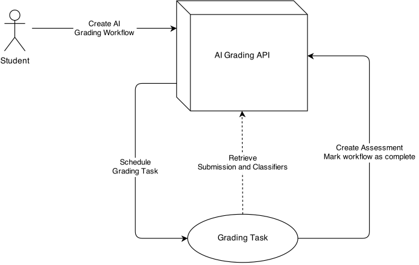
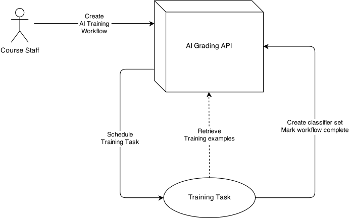

.. _ai_grading:

##########
AI Grading
##########

.. warning:: This is a DRAFT that has not yet been implemented.

Overview
--------

In this document, we describe the architecture for:

* Training a classifier using a supervised machine learning algorithm.
* Grading student essays using a trained classifier.

Both training and grading require more time than is acceptable within the
request-response cycle of a web application.  Therefore, both
training and grading must occur asynchronously.

The architecture should not constrain the ML algorithm (or algorithms)
used by a particular implementation.  It should be possible to replace
the ML algorithm with any supervised learning algorithm that produces
a text classifier.

We also avoid constraining the particular task queue implementation.
In principle, any task queue that provides basic reliability guarantees
and a retry mechanism will work (see :ref:`entities`).

Requirements
------------

* Grading tasks *must* be completed within hours after being scheduled.
  Ideally, the delay would be within several minutes, but students could
  tolerate longer delays during periods of high usage or failure recovery.
  The AI Grading API does not implement deadlines, so if a submission
  is submitted for grading (allowed when the problem is open),
  the student will receive a grade for the AI assessment step.

* Grading task queues must tolerate periods of high usage,
  as the number of submissions will likely increase when
  problem deadlines approach.

* Training tasks must also be completed within hours.  Tasks will
  likely be scheduled infrequently.

* Students must be able to submit even if classifiers have not yet been trained.
  Course authors will need to grade submissions to create
  the training examples used by the ML algorithm [#]_.

* Grading tasks must be fault tolerant.  If failures occur during grading,
  it must be possible to reschedule failed tasks.

.. [#] It may be possible for course authors to re-use submissions from a
  previous run of a course (perhaps run with only peer- and/or self-assessment).
  However, it's unclear whether this option will be acceptable to course teams.

.. _entities:

Entities
--------

* **AI Grading API**: An API that encapsulates all interactions with AI-grading database models and the task queue.  All inputs and outputs are JSON-serializable, so the API calls can be made in-process (likely the initial implementation) or through the network.

* **Submission**: An essay submitted by a student to a problem in a course.

* **Assessment**: Specifies the scores a submission received for each criterion in a rubric.

* **TrainingExample**: An example essay and associated scores (options selected in a rubric).

* **Classifier**: A function mapping submissions to scores.

* **Task** and **Task queue**

* **Worker**

Tasks
-----

Assumptions about the task queue implementation:

* **Reliability**: Each task placed on the queue will be picked up by at least one worker,
  although the task may not complete successfully.  Tasks should not get "lost"
  before reaching a worker.

* **Retry**: A worker can reschedule a task to handle recoverable errors.

* **Parameters**: We can parametrize tasks with JSON-serializable inputs.

We do **NOT** require:

* **Task Status**: We don't need to be able to query the status of tasks in-flight.

* **Notifications**: We don't need to be notified about task status changes.

* **Worker Pull or Push**: We assume that workers will pick up tasks, but we don't care how they
  find out about tasks.

* **Result storage**: Workers write results to the database (via the **AI Grading API**),
  so the task queue does not need to handle storage of results.

* **Periodic tasks**: All tasks are triggered by user actions.

* **Synchronization**: Tasks are independent and idempotent
  (at least from the perspective of clients of the **AI Grading API**), so we
  do not require synchronization mechanisms.

Tasks should be idempotent from the perspective of clients using the **AI Grading API**:

    * With the exception of "workflow" models, the database models created by tasks should be immutable and timestamped.
    * The **AI Grading API** should return the *most recent* assessment/classifier.

The above assumptions ensure that running a task twice (with equivalent workflow parameters) will
not change the assessment/classifiers returned by the API, even if additional records are created
in the database.

Grading Task
============

Parameter: AI Grading Workflow ID

Procedure:

1. A student submits an essay, creating a **submission** in the database.

2. The student updates the workflow, and the **Workflow API** uses the **AI Grading API** to:

    a. Retrieve the most recent **ClassifierSet** for the current rubric definition (possibly none if training hasn't yet finished).
    b. Create an **AI Grading Workflow** record in the database, associated with a Submission ID and **ClassifierSet**.
    c. Schedule a **Grading Task** parametrized by the workflow ID.

3. A worker picks up the **Grading Task** and uses the **AI Grading API** to:

    a. Retrieve the submission and classifiers from persistent storage or a cache.

        i. If the **ClassifierSet** is null, then the classifier wasn't available when the student created the submission.
        ii. Since we cannot grade the student without a classifier, we create the **AI Grading Workflow** record but do not schedule the **Grading Task**.  This means that the workflow will not be marked complete.
        iii. When a **Training Task** completes, update incomplete **Grading Tasks** with null **ClassifierSets** with the newly created **ClassifierSet**, then schedule the **GradingTasks**.

    b. **Optimization**: Check whether a completed **AI Grading Workflow** exists for this submission using the same **ClassifierSet**.

        i. If so, set the current workflow's **Assessment** to the other workflow's **Assessment** and exit with success.
        ii. This reduces the cost (in time) for rescheduling tasks that are in-flight but not yet completed (see :ref:`recovery_from_failure`).
        iii. Even without this optimization, the task is idempotent.  If a race condition occurs such that two *Assessments** are created, the **AI Grading API** will simply return the latest one.

    c. Evaluate the submission using each classifier.
    d. Create an **Assessment** with a type indicating that it is an AI assessment rather than self- or peer-assessment.
    e. Create an **AssessmentPart** for each rubric criterion, containing the score assigned by the classifier for that criterion.
    f. Mark the **AI Grading Workflow** as complete by associating the **Assessment** with the workflow.

4. When a student checks the status of the submission, the **AI Grading API**:

    a. Queries the database for the latest **AI Grading Workflow** matching the submission.
    b. Reports whether the workflow is started or complete.
    c. If the workflow is complete, the **AI Grading API** can retrieve the associated **Assessment**.

Training Task
=============

Parameter: AI Training Workflow ID

Procedure:

1. Course staff create **TrainingExamples** (using the same infrastructure, although not necessarily the same UI, as "Student Training" for peer assessment).

2. Course staff request that a classifier be trained based on staff assessments.  Using the **AI Grading API**, the request handler:

    a. Creates an **AI Training Workflow** record in the database, associated with **TrainingExamples** and an **ML Algorithm ID**.
    b. Schedules a **Training Task** parametrized by the workflow ID.

3. A worker picks up the **Training Task** and uses the **AI Grading API** to:

    a. Retrieve the *TrainingExamples* from persistent storage or a cache.
    b. Verify that all *TrainingExamples* use the same rubric.
    c. Train a classifier for each rubric criterion.  Choose the training algorithm based on the **ML Algorithm ID**.
    d. Commit the trained classifiers to persistent storage.
    e. Mark the **AI Training Workflow** as complete.

4. The worker uses the **AI Grading API** to schedule **AI Grading Tasks** for submissions made before the model was trained.  This is the same procedure used to manually reschedule grading tasks after a non-recoverable error (see :ref:`recovery_from_failure`).

5. Course staff can query the status of the training task using the **AI Grading API**, which in turn checks whether the latest **AI Training Workflow** is marked as started or complete.

Queues
------

In the simplest implementation, we could create separate queues dedicated to each task type.  It makes sense to separate the queues because the task types have very different usage patterns and performance requirements:

* **Training Tasks**: Infrequent, approximately 25-60 minutes per task, depending on the number of training examples and criteria).
* **Grading Tasks**: Frequent, less than 2 minutes per task (varies with the size of the submission and number of criteria).

.. _recovery_from_failure:

Recovery from Failure
---------------------

1. A scheduled task is not completed:

    a. We assume that the task queue is (for the most part) *reliable*:  If a task is scheduled, then a worker will pick it up and execute it (although it might not complete the task successfully).  Even if tasks occasionally are dropped, however, we can rely on the error recovery procedure below.

    b. If an error occurs, first retry the task.  This allows the worker to gracefully handle recoverable errors such as temporary network connectivity issues.

    c. If a task fails repeatedly, the worker should log the failure as a non-recoverable error and stop retrying the task.  Once the issue has been fixed, failed tasks should be rescheduled manually (e.g. by a command that queries for incomplete workflows and reschedules tasks).

2. A course author publishes a problem without training classifiers.

    a. All grading tasks scheduled without a classifier available will fail.

    b. We consider this a non-recoverable error and manually reschedule the tasks once the classifiers have been trained.

3. A course author modifies rubric criteria after training classifiers.

    a. If the problem has **NOT** been published: Warn the author that they will need to retrain the classifier before letting them save.
    b. If the problem **HAS** been published: Display a validation error and prevent the save (this is the current behavior).

3. Workers are not processing tasks quickly enough, causing queues to back up.

    a. Monitor queue length and alert if queue length is too long.
    b. Configure workers to time out if a task is taking too long to complete.
    c. Horizontally scale workers to handle additional load.

Data Model
----------

1. **GradingWorkflow**

    a. Submission UUID (varchar)
    b. ClassifierSet (Foreign Key, Nullable)
    c. Assessment (Foreign Key, Nullable)
    d. Rubric (Foreign Key): Used to search for classifier sets if none are available when the workflow is started.
    e. Algorithm ID (varchar): Used to search for classifier sets if none are available when the workflow is started.
    f. Scheduled at (timestamp): The time the task was placed on the queue.
    g. Completed at (timestamp): The time the task was completed.  If set, the task is considered complete.
    h. Course ID (varchar): The ID of the course associated with the submission.  Useful for rescheduling failed grading tasks in a particular course.
    i. Item ID (varchar): The ID of the item (problem) associated with the submission.  Useful for rescheduling failed grading tasks in a particular item in a course.

2. **TrainingWorkflow**

    a. Algorithm ID (varchar)
    b. Many-to-many relation with **TrainingExample**.  We can re-use examples for multiple workflows.
    c. ClassifierSet (Foreign Key)
    d. Scheduled at (timestamp): The time the task was placed on the queue.
    e. Completed at (timestamp): The time the task was completed.  If set, the task is considered complete.

3. **TrainingExample**

    a. Response text (text)
    b. Options selected (many to many relation with CriterionOption)

4. **ClassifierSet**

    a. Rubric (Foreign Key)
    b. Created at (timestamp)
    c. Algorithm ID (varchar)

5. **Classifier**

    a. ClassifierSet (Foreign Key)
    b. URL for trained classifier (varchar)
    c. Criterion (Foreign Key)

6. **Assessment** (same as current implementation)

    a. Submission UUID (varchar)
    b. Rubric (Foreign Key)

7. **AssessmentPart** (same as current implementation)

    a. Assessment (Foreign Key)
    b. Option (Foreign Key to a **CriterionOption**)

8. **Rubric** (same as current implementation)

9. **Criterion** (same as current implementation)

    a. Rubric (Foreign Key)
    b. Name (varchar)

10. **CriterionOption** (same as current implementation)

    a. Criterion (Foreign Key)
    b. Points (positive integer)
    c. Name (varchar)

Notes:

    * We use a URL to reference the trained classifier so we can avoid storing it in the database.
      In practice, the URL will almost certainly point to Amazon S3, but in principle we could use
      other backends.

    * Unfortunately, the ML algorithm we will use for initial release (EASE) requires that we
      persist the trained classifiers using Python's ``pickle`` module.  This has security implications
      (if the persisted classifiers are compromised, then someone could run arbitrary code on the workers);
      it also creates dependencies on external libraries used to create the pickled object (e.g. ``scikit-learn``).
      The proposed design accommodates the requirement that we use ``pickle``,
      but would also work with classifiers serialized to other formats -- we'd simply use a different
      algorithm ID and store the classifier in a non-pickle format.
