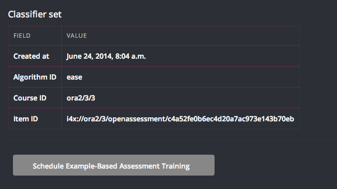

.. _migrate_ai:

Migrating AI Problems
---------------------

ORA2 supports AI assessment for student responses, but currently does not support authoring of AI problems.  In order to migrate an existing AI assessment problem into ORA2, you will need to:

1. Create a problem with example-based assessment enabled.

    a. Create an ORA2 problem in a course.  See `the user documentation <http://edx.readthedocs.org/projects/edx-open-response-assessments>`__ for directions.

    b. `Export the course using Studio <http://ca.readthedocs.org/en/latest/building_course/export_import_course.html>`__

    c. Untar the exported course and find the problem XML.  You can search for the HTML tag "openassessment".

    d. Add the AI ("example-based") assessment to the XML, including the example essays and scores.  The selected criteria and options **must** match the rubric in the XML definition.

.. code:: xml

        <assessment name="example-based-assessment" algorithm_id="ease">
            <example>
                <answer>First essay</answer>
                <select criterion="Ideas" option="Bad" />
                <select criterion="Content" option="Bad" />
            </example>
            <example>
                <answer>Second essay</answer>
                <select criterion="Ideas" option="Good" />
                <select criterion="Content" option="Bad" />
            </example>
            <example>
                <answer>Third essay</answer>
                <select criterion="Ideas" option="Bad" />
                <select criterion="Content" option="Good" />
            </example>
        </assessment>
..

    e. Archive the course in "tar.gz" format.

    f. `Import the course into Studio <http://ca.readthedocs.org/en/latest/building_course/export_import_course.html>`__

2. Train classifiers.

    a. Log in to the LMS as global staff.  (If your account does not have global staff permissions, you will need to run a Django management command).

    b. Navigate to the ORA2 problem you created.

    c. In the "Course Staff Information" section (at the bottom of the problem), click the button "Schedule Example-Based Training"

    d. When training completes (should take ~1 hour), the "Course Staff Information" section will show that a classifier has been trained.

3. At this point, students can submit essays and receive grades.
