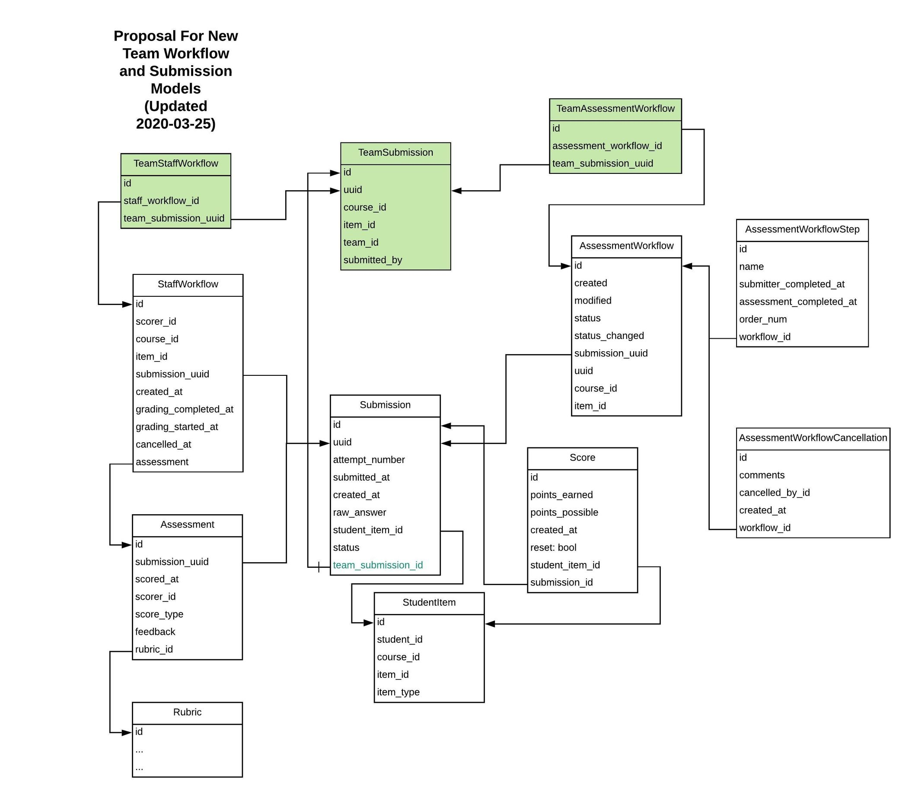
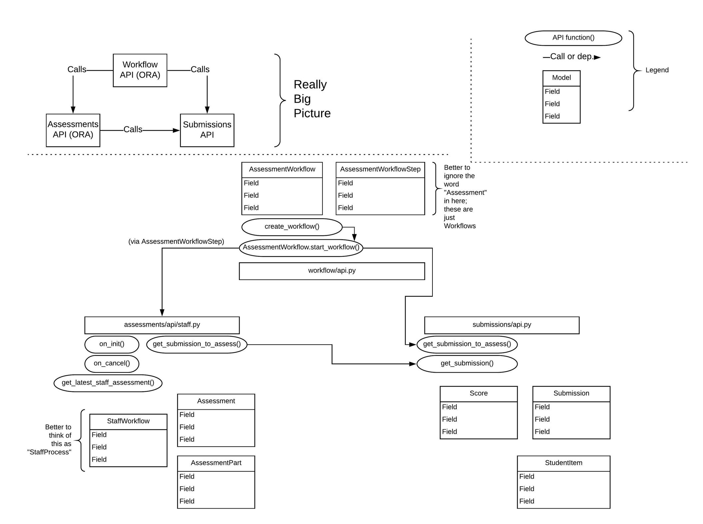

ORA2 Team Submissions
=====================

.. contents::

Workflows
---------

There’s an AssessmentWorkflow model that has a workflow app label, which means that the table name is prefixed with `workflow_` and not `assessment_` like everything else (I’m sure it’s to help resolve a name collision).  `See for reference: <https://github.com/edx/edx-ora2/blob/001a6804e605426fdc43d4b5d83a38051c756c8d/openassessment/workflow/models.py#L108>`_.  In fact, each of the AssessmentWorkflow, AssessmentWorkflowStep, and AssessmentWorkflowCancellation models live under the workflow app label.

- The ``SubmissionMixin.create_submission()`` method calls the ``workflow_api.create_workflow()`` method  (it stops at ``WorkflowMixin.create_workflow()`` along the way).  This is the entry point to workflow management in ORA.

- ``create_workflow()`` calls ``AssessmentWorkflow.start_workflow()`` 

  - …which calls the ``on_init()`` method of each specific type of step (e.g. self, peer, staff).

  - The ``on_init()`` method of e.g. StaffWorkflow is what creates a StaffWorkflow record associated with a given course, item, and submission (and eventually, a scorer and an assessment).

Staff Workflows
---------------

These should be the only workflow type that we care about for team submissions.

`Python API for managing StaffWorkflow data: <https://github.com/edx/edx-ora2/blob/master/openassessment/assessment/api/staff.py>`_:

- **on_init(submission_uuid)**

  - Looks up submission record from Submissions API.  Then creates a StaffWorkflow associated with it.

**For teams:**

- We will have one workflow per team - there’s no value in creating e.g. 5 workflows for a team of 5 learners when we only want 1 of those 5 workflows to be acted on by course staff.

- From the perspective of grading, it doesn’t matter, as long as we end up in a state where there is one Score per learner.

Data Models Design
------------------
Motivation
^^^^^^^^^^

- For course staff to grade learners' team-based submissions, we have to allow staff to “pull” from a pool of team-based submissions in a different manner from how submissions are pulled for individual submissions.

- The ``StaffWorkflow`` model contains a ``get_submission_for_review()`` method that returns a new submission for staff to review.

- At the completion of the assessment, we need each team member’s submission record to have a corresponding ``Score`` (and each score within the team-assignment should be identical).

New Models, sublcass StaffWorkflow
^^^^^^^^^^^^^^^^^^^^^^^^^^^^^^^^^^

- Create a new ``TeamStaffWorkflow`` model that inherits from ``StaffWorkflow``.

- Create a new ``TeamSubmission`` model with a many to many relationship to ``Submission``.  The ``TeamStaffWorkflow`` now references a ``TeamSubmission``.

- The TeamSubmission model also records who submitted on behalf of the team.

- We’ll actually also need a new, team-centric version of the ``workflow.AssessmentWorkflow`` model, so that we can pass a ``team_submission_uuid`` to the ``start_workflow()`` method.  It will follow the same flow of logic of creating a workflow record and associated steps.

  - ``AssessmentWorkflow.start_workflow()`` calls the ``on_init()`` function of each `assessment type’s API, e.g. <https://github.com/edx/edx-ora2/blob/master/openassessment/assessment/api/staff.py#L59>`_ In fact, pretty much all of the functions provided by assessment API’s require a ``submission_uuid`` parameter.  So we’ll likely want some new API like ``assessment.api.team`` that provides the same functionality, but takes a ``team_submission_uuid`` as the first parameter.

No new team-based AssessmentWorkflowStep model.  All that the steps care about are their types and the corresponding workflow instance.  

Diagrams
--------

Behavior on Submit
------------------
- For team ORA submissions, only staff assessment types are allowed (or no assessment types at all, in the case of practice assignments).

 - Peers should not see Team Submissions in their workflows.

 - “Selves” should not see Team Submissions in their workflows.

- A ``Submission`` record should be created for each member of the team.

- One ``TeamSubmission`` record should be created for the team.

- One ``TeamAssessmentWorkflow`` should be created for the team.

 - Because this inherits from ``AssessmentWorkflow``, we can use ``AssessmentWorkflowCancellation`` for team workflows, too, without any model changes.

 - There will be one “content reference” submission that points to the ``AssessmentWorkflow`` that’s associated with the ``TeamAssessmentWorkflow`` - this is the submission that’s used to show text/file content to instructors while the team submission is being assessed.

- If the `staff` assessment step (which is the only valid assessment type for team-based ORAs) is selected for the block, one ``TeamStaffWorkflow`` record is created for the team.

- One ``Assessment`` record and (eventually, after grading) one ``Score`` record **per team member** is/are created.
